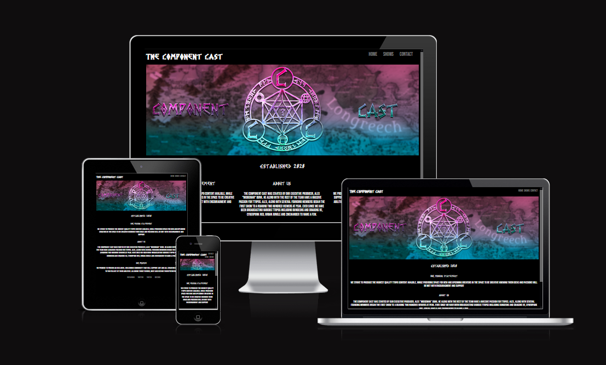
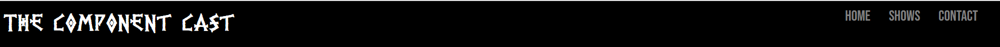
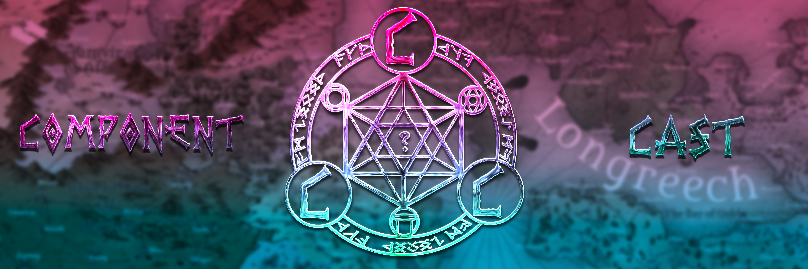
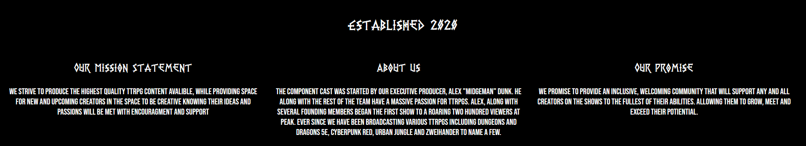
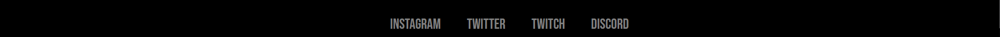
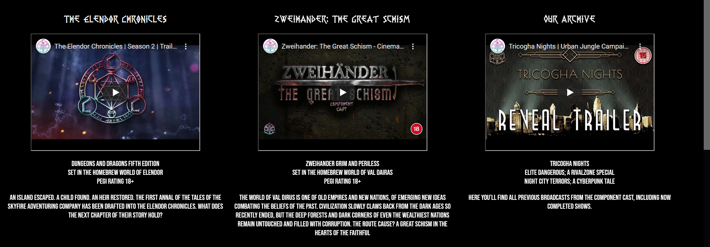

# The Component Cast

The Component Cast is a Tabletop Roleplay Broadcast network, that provides a highly entertaining selection of shows and a place to promote and work on your own projects of homebrew content and writing.

This website is to help broaden the reach of the Component Cast and give new potential fans a place where they can find all of the content that the Component Cast produces in one area, easily finding the particular content form they're looking for. 

The Live Link can be found here; [Component Cast Website](https://mikeyredmon.github.io/ComponentCastWebsite/)

## Project Goals

### Design Objectives

- Intuitive Experiance
- Clean Design
- Ease of Cross Promotion (Twitch, Twitter, Instagram.)
- Provide a solid foundation for future updates and upgrades to website functionality. 

### User Stories 

- As a user, I want to be able to understand what this website is about from the landing page
- As a user, I want to be able to read more about the things the Component Cast does concisely. 
- As a user, I want to be able to contact the show directly. 

## Existing Features

#### Naviation Bar

Featured on all three pages, the Navigation bar allows for easy and simple naviation between the Home, Shows and Contact page. Its identical styling in each page makes it highly intuitive. 

#### The Home Page

The landing page includes a hero image to draw the eye. It also includes a bit of text to show the year that The Component Cast was established. 

#### The Information Section

The Information section contains several boxs of text; Describing the Component cast Mission Briefing, a Promise made to the viewers and a small blurb about the formation of the Component cast itself. 

#### The Footer

The footer contains several responsive elements that allow direct links to the Component Cast social media accounts. Including Twitch and Discord for direct messaging interaction with the cast. 

### The Shows Page

#### Shows

The Shows section contains embedded youtube players for the trailers of the major currently running and an archive channel, general information about the shows content including the system used, the ESRB/PEGI rating and a short synapsis of the show premise. 

#### Coming Soon 

In the Coming Soon Section, there is an embedded tweet to a casting call for the next Component Cast show, allowing any interested parties to directly audition for the shows. This can be updated in the future, allowing for futureproofing of the website design.

### The Contact Us Page

#### Contact Content

On this page there is an embedded twitter feed, along with an embedded instagram post to give another option for direct interaction with the Component Casts Social medias. There is also a form to sign up for a Component Cast newsletter. 

## Features left to implement

- I would like to come back and allow the register button to send any information registered to a server. 
- I would like to add an embedded video player to the Shows page of the twitch channel. 
- I would like to add an auto updating calander to allow users to see when the channel goes live.

## Testing. 

The features of the website; That being the Navlist, the video players, the embedded tweet, twitter feed and instagram post all work as intended. As well as the form functioning as intended. 

I tested the Navlist items by hovering over them with my mouse; the colour of the elements changed and when I clicked on them it brought me to the correct page. 

The embedded tweet works as intented, appearing on the page and when clicked on it links directly to the tweet in question. 

The video players load when I click on the Shows page, but they do not auto play. 

The tweeter feed updates when the Component Cast twitter account tweets, or retweets something and is working as intended. 

The Instagram post is fully functional, and would allow any potiental user to directly interact with the account. 

The website is responsive and when the width of the viewing portal shrinks the items stack on top of each other, allowing for easier consumption of the content. 

### Validator

Running the HTML through a validator does show a few errors, which I will expand on in the Bugs section. 

Running the CSS through a validator shows no errors. 

### Unfixed Bugs

Due to the code used in the Embedded youtube video players, tweet, tweeter feed and Instagram post, it comes up as an error on the HTML validator. Unfortunately, changing the code changes the view so I have to leave them be. 

## Deployment 

The Site is deployed on Gibhub Pages. 

In the Github Repository navigate to the settings tab, from there the source section drop down menu select the master Branch. Once the master branch is selected it will be automatically refreshed with a detailed ribbon display. 

The Live Link can be found here; [Component Cast Website](https://mikeyredmon.github.io/ComponentCastWebsite/)

## Credits

### Content 

The PR Viking font was created by Pter Rempel, and the Bebas Neue Font was created by Dharma Type. 

### Media

The Images and icons where produced, created and provided by Alex Dunk. CEO of The Component Cast. 
